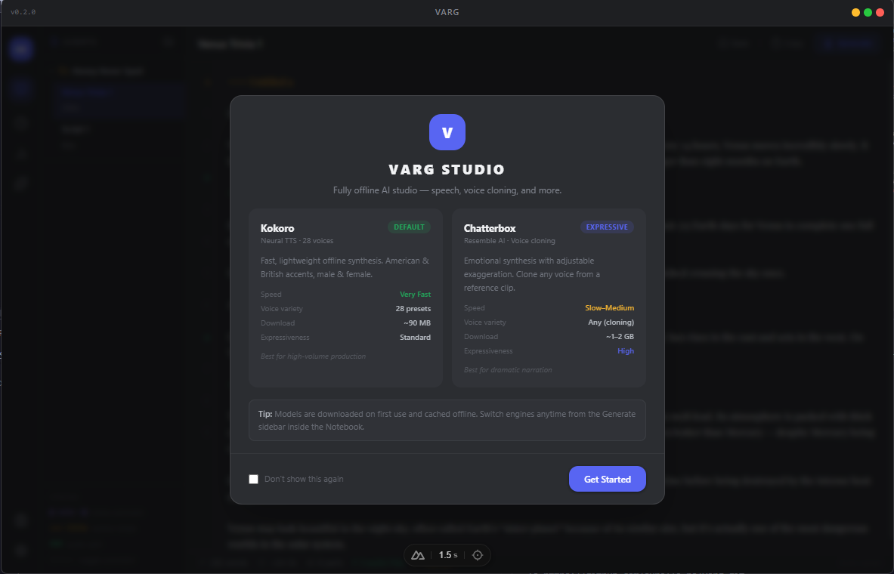

# Varg Studio

> Fully offline AI studio for speech synthesis, voice cloning, and script production.  
> No cloud. No subscription. Runs entirely on your machine.



---

## Features

- **Kokoro TTS** — 28 voices (American & British), WebGPU + CPU WASM inference
- **Chatterbox Voice Cloning** — clone any voice from a 10–30 s reference clip, adjustable exaggeration
- **Script Maker** — folder-based script editor with inline comments, section headers, and multi-part audio generation
- **Generation History** — every audio saved locally in IndexedDB with full metadata
- **MCP Server** — expose Varg as an MCP endpoint so AI agents can generate speech programmatically
- **System Monitor** — real-time CPU, GPU, and memory usage with a floating overlay

---

## Requirements

| Tool | Version |
|------|---------|
| Node.js | ≥ 22 |
| pnpm | ≥ 9 |
| Rust + Cargo | stable (latest) |
| WebView2 | ships with Windows 10/11 |

> **Windows only.** Tauri targets `nsis` for the installer.

---

## Environment Setup

### 1. Install prerequisites

```powershell
# Node.js — https://nodejs.org (LTS recommended)
# pnpm
npm install -g pnpm

# Rust — https://rustup.rs
winget install Rustlang.Rustup
rustup toolchain install stable
```

### 2. Install Tauri CLI v2

```powershell
cargo install tauri-cli --version "^2"
```

### 3. Clone and install dependencies

```powershell
git clone https://github.com/surelle-ha/varg.git
cd varg
pnpm install
```

---

## Development

```powershell
# Desktop app — Nuxt dev server + Tauri shell (hot-reload)
pnpm --filter desktop tauri:dev

# Nuxt only — no Tauri window (faster iteration on UI)
pnpm --filter desktop dev

# Type-check
pnpm --filter desktop typecheck

# Landing page (http://localhost:3001)
pnpm --filter landing dev
```

---

## Building from Source

```powershell
# Produces an NSIS installer at:
#   apps/desktop/src-tauri/target/release/bundle/nsis/Varg_x.y.z_x64-setup.exe
pnpm --filter desktop tauri:build
```

The build runs `nuxt generate` (static export) then compiles the Rust shell.  
The resulting `.exe` is fully self-contained — no separate runtime required.

---

## AI Model Files

Models are **not bundled** with the installer. They are downloaded on first use and cached in the browser's CacheStorage (inside the Tauri WebView2 profile).

| Model | Cache size | When downloaded |
|-------|-----------|-----------------|
| Kokoro CPU (q8) | ~82 MB | First generation or Model page |
| Kokoro GPU (fp16) | ~163 MB | Same |
| Kokoro voices (28 × .bin) | ~90 MB | Same |
| Chatterbox ONNX | ~1–2 GB | First Chatterbox generation or Pre-load |

To pre-download Kokoro for local development (optional):

```powershell
pnpm --filter desktop model:download
```

---

## Repository Structure

```
varg/
├── apps/
│   ├── desktop/          # Tauri 2 + Nuxt 4 desktop app
│   │   ├── components/   # Vue components
│   │   ├── composables/  # Module-scope reactive singletons
│   │   ├── workers/      # Web Workers — Kokoro & Chatterbox ONNX inference
│   │   ├── src-tauri/    # Rust shell (window frame, packaging, CSP bypass)
│   │   └── public/       # Static assets, model placeholder files
│   └── landing/          # Nuxt 4 landing / download page
├── docs/
│   └── snapshots/        # App screenshots (add PNG files here)
└── .github/
    └── workflows/        # CI/CD (build-test.yml, build-release.yml)
```

---

## Branch Workflow

```
feature/*  →  test   →  QA / beta artifact built by CI
                  ↓
               main   →  release build; tag v* publishes GitHub Release
```

See [`.github/BRANCH_PROTECTION.md`](.github/BRANCH_PROTECTION.md) for the required branch protection settings.

To publish a release after merging to `main`:

```powershell
git tag v0.3.0
git push origin v0.3.0
```

The release workflow builds the installer and creates a GitHub Release automatically.

---

## Contributing

1. Fork the repo and create a `feature/your-feature` branch off `test`
2. Open a PR targeting the `test` branch — CI builds a beta artifact
3. Once QA passes, a maintainer opens a PR from `test` → `main`
4. Direct pushes to `main` are not permitted

---

## License

MIT © [Vindicta](https://github.com/surelle-ha)
